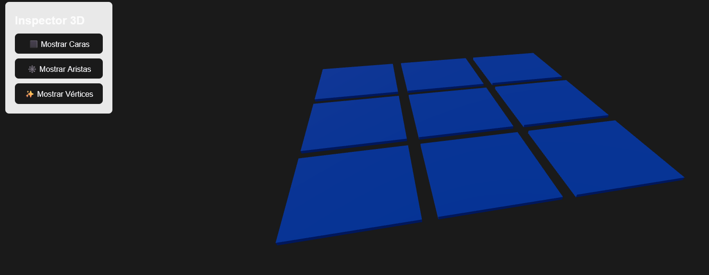
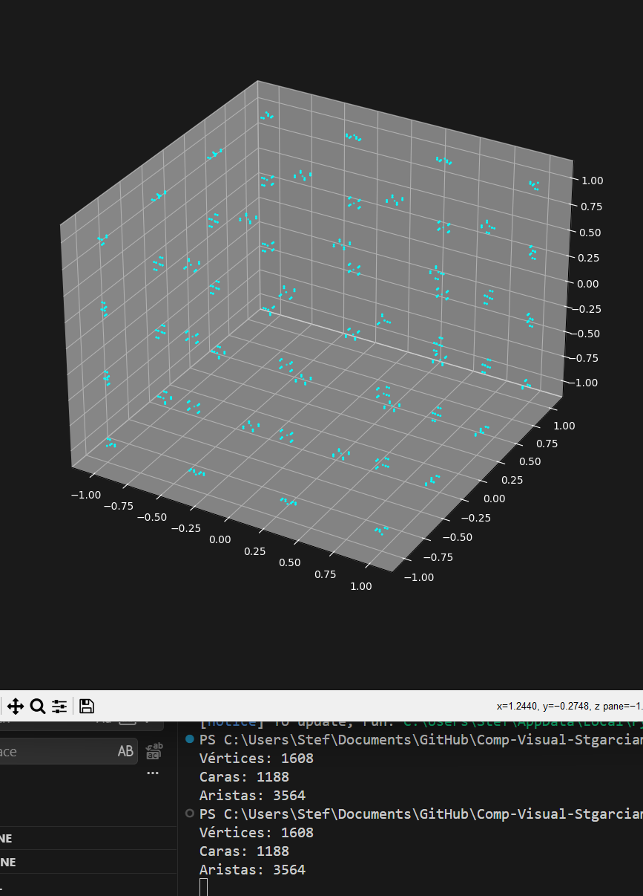

# Taller Construyendo Mundo 3D

 Stephan A. R. Garcia M.
 21/02/26


En este taller se exploraron las estructuras gráficas básicas que conforman los modelos 3D. Se utilizó un modelo en formato GLTF para visualizar su estructura alámbrica, vértices y caras  en un entorno web con Three.js y mediante un script de análisis en Python aunque, por alguna razon, la visualizacion de vertices no aparece por mas que se cambie el codigo

## Implementaciones

### 1. Entorno Web (Three.js / React Three Fiber)
Se creó una escena interactiva utilizando Vite y `@react-three/fiber`. El modelo GLTF se carga  y cuenta con una interfaz gráfica que permite alternar la visualización entre:
- Malla sólida (`meshStandardMaterial`)
- Estructura alámbrica forzada (`wireframe`)
- Nube de puntos/vértices (`Points` y `PointMaterial`) que no se logra hacer funcionar

### 2. Entorno de Análisis (Python)
Se desarrolló un script utilizando `trimesh` y `matplotlib`. El script lee el archivo GLTF, consolida sus jerarquías y toma la cantidad de vértices, caras y aristas. De ahi, renderiza un gráfico de dispersión 3D de sus vértices. 

## Resultados visuales

### Entorno Web (Three.js)


### Entorno Python


## Código Relevante

**Carga del modelo en React Three Fiber:**
```jsx
const { nodes } = useGLTF('/modelo.gltf');
const meshNode = Object.values(nodes).find((node) => node.isMesh);